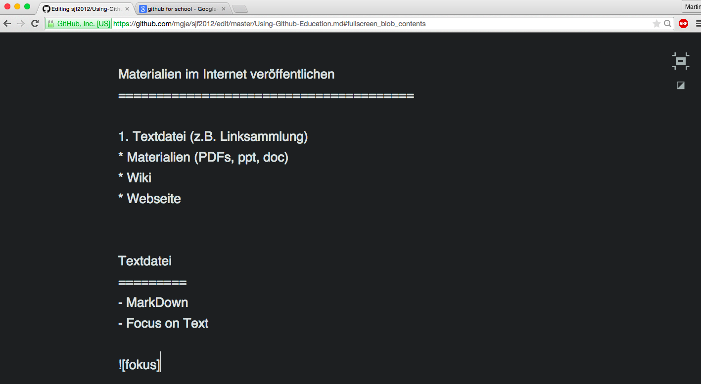

# GitHub-for-Education

Informationen und Materialien im Internet veröffentlichen
=========================================================
1. Textdatei (z.B. Linksammlung)
* Wiki
* Webseite

Einrichten / Anfangen
=====================

1. GitHub account erstellen https://github.com (https://help.github.com/articles/signing-up-for-a-new-github-account/)
2. Neues Repository 
3. Readme.txt schreiben
4. GH Pages https://help.github.com/enterprise/2.8/user/articles/creating-pages-with-the-automatic-generator/


Text
=========
- MarkDown
- Focus on Text



- Linksammlungen
  - [MarkDown Basics](https://help.github.com/articles/markdown-basics/)
  - [GitHub MarkDown](https://help.github.com/articles/github-flavored-markdown/)
  - [Writing on Github](https://help.github.com/articles/writing-on-github/)
  - [GitHub Tutorials](https://help.github.com/articles/good-resources-for-learning-git-and-github/)
  

Dateien online stellen
======================
- [Folien zu SJf2012 (PDF)](https://github.com/mgje/sjf2012/blob/master/Vortrag/Pra%CC%88sentation%20SJF.pdf)
- [Word Datei](https://github.com/pirent/Documents/blob/master/config.docx)
- [PowerPoint Dateien](https://github.com/andrepoleza/pptx)

Wiki & GitHub
=============
- [Github Wiki help](https://help.github.com/articles/about-github-wikis/)
- [https://education.github.com/](https://education.github.com/)
- [Beispiel Präsentationen mit HTML5](https://github.com/hakimel/reveal.js/wiki/Example-Presentations)

GitHub Pages
============
- [Eigene Webseite](https://pages.github.com/)
- [Beispiel interaktive Webseite](http://mgje.github.io/draw/)
- [Beispiel interaktive Webseite Quellen](https://github.com/mgje/draw)

Programme
=========

```python
from gpanel import *

KEY_LEFT = 37
KEY_RIGHT = 39
KEY_UP = 38
KEY_DOWN = 40

def drawCircle():
    move(x, y)
    setColor("green")
    fillCircle(5)
    setColor("black")
    circle(5)
    
makeGPanel(0, 100, 0, 100)
text("Move the circle with the arrow keys.")
x = 50
y = 50
step = 2
drawCircle()
 
while True:
    key = getKeyCodeWait()
    if key == KEY_LEFT:
        x -= step
        drawCircle()
    elif key == KEY_RIGHT:
        x += step
        drawCircle()
    elif key == KEY_UP:
        y += step
        drawCircle()
    elif key == KEY_DOWN:
        y -= step
        drawCircle() 
``` 
